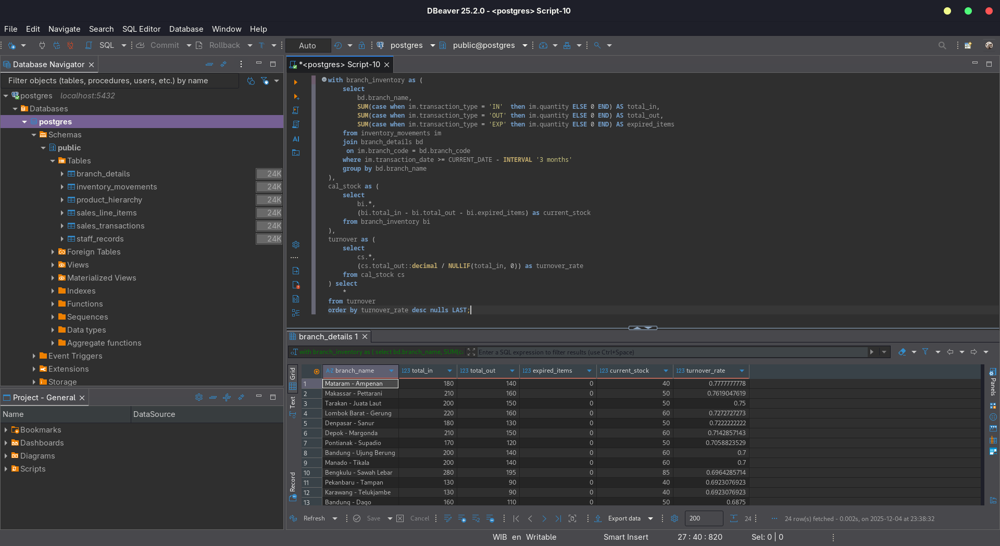
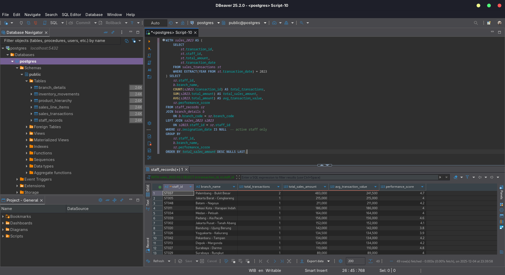

# 1. SQL Assessment

## Overview

Dokumen ini berisi implementasi untuk **Soal Nomor 1** dari *Data Engineer Assessment*.  
Tujuan utama assessment ini adalah membuat query untuk menghitung inventory turnover per branch dan staff performance and sales.

## Tools Used
- PostgreSQL
- Docker
- DBeaver


## Struktur Repository
    1-sql-assessment/
    │
    ├── queries/
    │ ├── 001-ddl_query.sql
    │ ├── 002-mock-data.sql
    │ ├── inventory-turnover.sql
    │ └── staff-performance-and-sales.sql
    ├── results/
    │ ├── inventory-turnover.csv
    │ ├── inventory-turnover.png
    │ ├── staff-performance-and-sales.csv
    │ └── staff-performance-and-sales.png
    │
    └── README.md

## Database Schema (DDL)

Database Schema dibuat dengan DDL yang diberikan di soal assessment. Yang terdiri dari 6 tabel, yaitu:

- `branch_details`
- `inventory_movements`
- `product_hierarchy`
- `sales_line_items`
- `sales_transactions`
- `staff_records`

Pembuatan database schema dapat dilihat pada file `queries/001-ddl_query.sql` dan dijalankan bersamaan dengan deployment container database.

## Mock Data

Mock data dibuat manual menggunakan query yang berada di `queries/002-mock-data.sql`, dengan menghasilkan data yang konsisten dan sesuai dengan skema database, seperti: 

- Stok masuk dan keluar pada berbagai cabang  
- Staf aktif & nonaktif  
- Riwayat expired items  
- Penjualan multi-product  
- Berbagai kategori dan sub-kategori produk  

Query tersebut juga dijalankan bersamaan dengan deployment container database.

Contoh Data:

##### sales_line_items
```
transaction_id|line_number|product_code|quantity|unit_price_at_time|discount_percentage|total_line_amount|
--------------+-----------+------------+--------+------------------+-------------------+-----------------+
T001          |          1|P003        |       2|          15500.00|               0.00|         31000.00|
T001          |          2|P031        |       3|           5500.00|              10.00|         14850.00|
T002          |          1|P014        |       2|           7000.00|               0.00|         14000.00|
```

##### inventory_movements

```
movement_id|product_code|branch_code|transaction_type|quantity|transaction_date|batch_number|expiry_date|unit_cost_at_time|
-----------+------------+-----------+----------------+--------+----------------+------------+-----------+-----------------+
          1|P001        |BR001      |IN              |     120|      2025-10-03|B001        | 2025-12-22|         52000.00|
          2|P001        |BR001      |OUT             |      80|      2025-10-08|B001        |           |         52000.00|
          3|P001        |BR001      |EXP             |       5|      2025-10-13|B001        | 2025-11-27|         52000.00|
```

## Query Jawaban

#### **Inventory Turnover per Branch (3 bulan terakhir)**  

Mencari:

- total IN  
- total OUT  
- expired stock  
- current stock  
- turnover rate

Query lengkap:  

```sql
with branch_inventory as (
	select 
		bd.branch_name,
		SUM(case when im.transaction_type = 'IN'  then im.quantity ELSE 0 END) AS total_in,
	    SUM(case when im.transaction_type = 'OUT' then im.quantity ELSE 0 END) AS total_out,
	    SUM(case when im.transaction_type = 'EXP' then im.quantity ELSE 0 END) AS expired_items
	from inventory_movements im 
	join branch_details bd 
	 on im.branch_code = bd.branch_code
	where im.transaction_date >= CURRENT_DATE - INTERVAL '3 months'
	group by bd.branch_name
), 
cal_stock as (
	select 
		bi.*,
		(bi.total_in - bi.total_out - bi.expired_items) as current_stock
	from branch_inventory bi
),
turnover as (
	select 
		cs.*,
		(cs.total_out::decimal / NULLIF(total_in, 0)) as turnover_rate
	from cal_stock cs
) select 
	* 
from turnover 
order by turnover_rate desc nulls LAST;
```

#### **Staff Performance and Sales (Tahun 2023)**

Mencari:

- total transaksi per staf
- total sales amount
- average transaction value
- hanya staf aktif (resignation_date IS NULL)

Query lengkap: 

```sql
WITH sales_2023 AS (
    SELECT 
        st.transaction_id,
        st.staff_id,
        st.total_amount,
        st.transaction_date
    FROM sales_transactions st
    WHERE EXTRACT(YEAR FROM st.transaction_date) = 2023
) SELECT
    sr.staff_id,
    b.branch_name,
    COUNT(s2023.transaction_id) AS total_transactions,
    SUM(s2023.total_amount) AS total_sales_amount,
    AVG(s2023.total_amount) AS avg_transaction_value,
    sr.performance_score
FROM staff_records sr
JOIN branch_details b 
    ON b.branch_code = sr.branch_code
LEFT JOIN sales_2023 s2023
    ON s2023.staff_id = sr.staff_id
WHERE sr.resignation_date IS NULL  -- active staff only
GROUP BY 
    sr.staff_id,
    b.branch_name,
    sr.performance_score
ORDER BY total_sales_amount DESC NULLS LAST;
```

## Hasil Query Jawaban

Untuk mendapatkan hasil query tersebut saya menggunakan tools DBeaver dan menjalankan query secara manual.  
Hasilnya dapat dilihat pada folder `results`.

Screenshot query inventory turnover per branch:


Screenshot query staff performance and sales:


## Time Spent
- Development: 1 jam
- Testing: 1 jam
- Dokumentasi: 30 menit

## AI Utilization

1. Mock Data Generator:
    - Build: 
        - Utilize AI to create SQL Query for mock data generation.
    - Deliverable: 
        - "Give me a SQL Query that generates mock data like 50 rows for each table. Try make it based on this schema tables: (_Given DDL Schema Query_)"